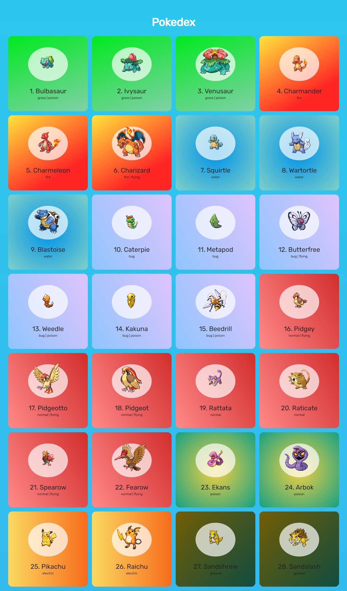

#  Pokedex 🐲

## Introduction 📑
This project is code for filtering posts and infinite scroll, in javascript.

* 📌 This project was done in a didactic way in order to improve my knowledge of the technologies used.
* 📌 The technologies used for the development of the project were, (HTML, CSS and JAVASCRIPT), with greater focus on learning javascript.
* 📌an API called pokeApi was used to develop this application. from there through requests we can get the pokemons shown on the screen.
* 📌 This project is not hosted.

# Project Layout 🎨

